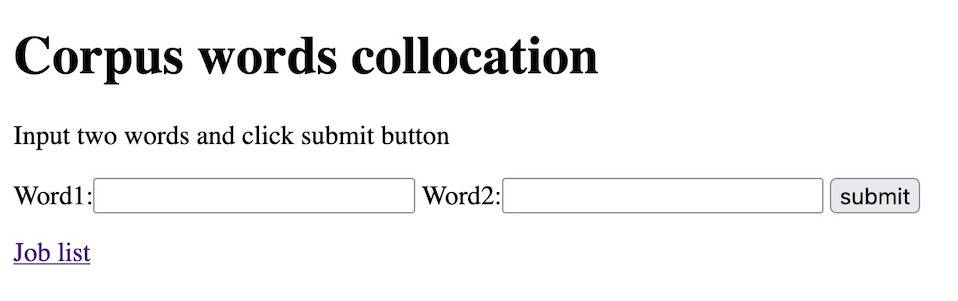

# Collocation on Rails

## How to install

### 1.  必要なもの (Requirements)

1. Docker (https://www.docker.com/)
 * もしDocker Engineがインストールされていなければ、インストールしてください
 * インストール方法はOSによって異なりますので、ここではインストール方法は省略します
 * 各自インターネットで調べてインストールしてください
2. コーパスデータベース
 * 実行には「わかち書き」されたコーパスデータベースが必要です
 * 下記のdockerコマンドを実行するディレクトリにshare/corpus.txtというファイル名で配置してください

### 2. Download the Docker image

以下のコマンドを実行して、Docker imageをダウンロードしてください
```
$ docker pull masaomi/rails
```

### 4. Start Ruby on Rails with Docker container

以下のコマンドを実行して、Rails (Docker container) を起動してください
```
$ docker run -itd --name collocation-rails -p 80:80 -v `pwd`/share:/home/rails/share --env BASIC_AUTH_USER=username --env BASIC_AUTH_PASSWORD=password --workdir /home/rails/collocation_rails masaomi/rails bundle exec rails s -e production -b 0.0.0.0 -p 80
```

もし、Docker containerを起動してからRailsを起動したい場合は以下のようにしてください
```
$ docker run -it --name collocation-rails -p 80:80 -v `pwd`/share:/home/rails/share masaomi/rails bash
(docker containerにlogin)
% export BASIC_AUTH_USER=username 
% export BASIC_AUTH_PASSWORD=password
% cd collocation_rails
% bundle exec rails s -e production -b 0.0.0.0 -p 80
```

Note
* ctl+c で実行を停止できます
* Docker containerを -d でdetachした場合は、docker container start/stop collocation-railsでcontainerを起動/停止出来ます
* Docker containerにloginするには docker exec -it collocation-rails bash でloginできます
* ユーザーrailsのpasswordはrailsで、sudoersグループに属しているので、sudoが使えます

## 4. Access test

以下のURLにブラウザでアクセスして、上で設定したUserIDとPasswordを入力して、トップページが見られたら成功です。
* http://localhost


